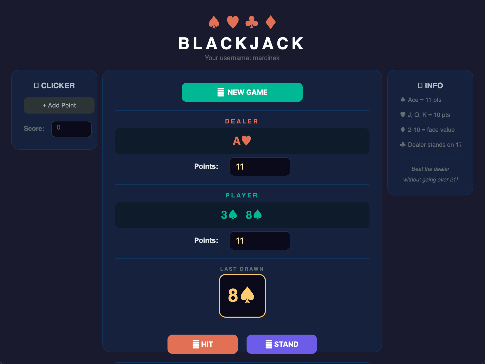

# ♠ Logowanie + Blackjack ♠

Prosta desktopowa gra **Blackjack** z modułem logowania i tworzenia konta, napisana w **C#** z wykorzystaniem frameworka **Avalonia UI**.

<p align="center">
  
  &nbsp;&nbsp;&nbsp;
  
</p>

---

## 📖 Opis

Aplikacja składa się z trzech ekranów:

1. **Ekran logowania** — użytkownik wpisuje login i hasło, aby uzyskać dostęp do panelu gry.
2. **Ekran rejestracji** — formularz tworzenia nowego konta z walidacją hasła (minimum 5 znaków, co najmniej jeden `@`, co najmniej 2 cyfry, brak spacji).
3. **Panel gry Blackjack** — główny ekran z grą karcianą, wyświetlaniem kart, punktów oraz werdyktu z możliwością rozpoczęcia nowej gry lub wyjścia z aplikacji.

---

## 🎮 Funkcjonalności

- 🔐 **Logowanie** — weryfikacja danych użytkownika
- 📝 **Rejestracja** — tworzenie konta z walidacją siły hasła
- 🃏 **Gra Blackjack** — pełna rozgrywka przeciwko krupierowi:
  - Tasowanie talii (52 karty)
  - Dobieranie kart (HIT)
  - Zatrzymanie się (STAND) — krupier dobiera karty automatycznie z opóźnieniem
  - Wyświetlanie nazw kart (np. `K♠`, `A♦`, `10♣`)
  - Sprawdzanie Blackjacka (21 punktów na starcie)
  - Overlay z wynikiem gry + przyciski „Kolejna gra" / „Wyjdź"
- 🎯 **Mini-gra Clicker** — dodatkowy licznik punktów na panelu

---

## 🛠️ Technologie

| Technologia | Wersja |
|:---|:---|
| **C#** | .NET 10 |
| **Avalonia UI** | 12.0.5 |
| **Fluent Theme** | Avalonia.Themes.Fluent |

---

## 🚀 Uruchomienie

```bash
# Sklonuj repozytorium
git clone <url-repozytorium>
cd MojeLogowanieGUI

# Przywróć zależności i uruchom
dotnet restore
dotnet run
```

---

## 📁 Struktura projektu

```
MojeLogowanieGUI/
├── App.axaml                 # Konfiguracja aplikacji i motywu
├── App.axaml.cs
├── Program.cs                # Punkt wejścia aplikacji
├── MainWindow.axaml          # UI ekranu logowania
├── MainWindow.axaml.cs       # Logika logowania
├── RegisterWindow.axaml      # UI ekranu rejestracji
├── RegisterWindow.axaml.cs   # Logika rejestracji i walidacji hasła
├── PanelWindow.axaml         # UI panelu gry Blackjack
├── PanelWindow.axaml.cs      # Logika gry Blackjack
├── card.cs                   # Klasa Card + enumy Rank i Suit
└── MojeLogowanieGUI.csproj   # Plik projektu .NET
```

---

---

## 🃏 Zasady Blackjacka

| Karta | Wartość |
|:---|:---|
| 2–10 | Wartość nominalna |
| J, Q, K | 10 punktów |
| A (As) | 11 punktów |

- Celem gry jest uzyskanie sumy punktów jak najbliższej **21**, nie przekraczając tej wartości.
- Na początku gracz otrzymuje **2 karty**, a krupier **1 kartę**.
- Gracz może **dobierać karty** (HIT) lub **zatrzymać się** (STAND).
- Po zatrzymaniu się gracza, krupier dobiera karty automatycznie dopóki ma **16 lub mniej** punktów.
- Przekroczenie 21 punktów oznacza **automatyczną przegraną**.

---

## 👤 Autor

Marcin Pawlak — projekt w ramach nauki C# (Semestr 3)
